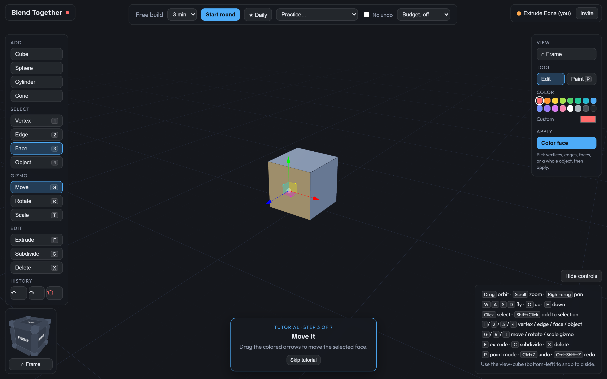
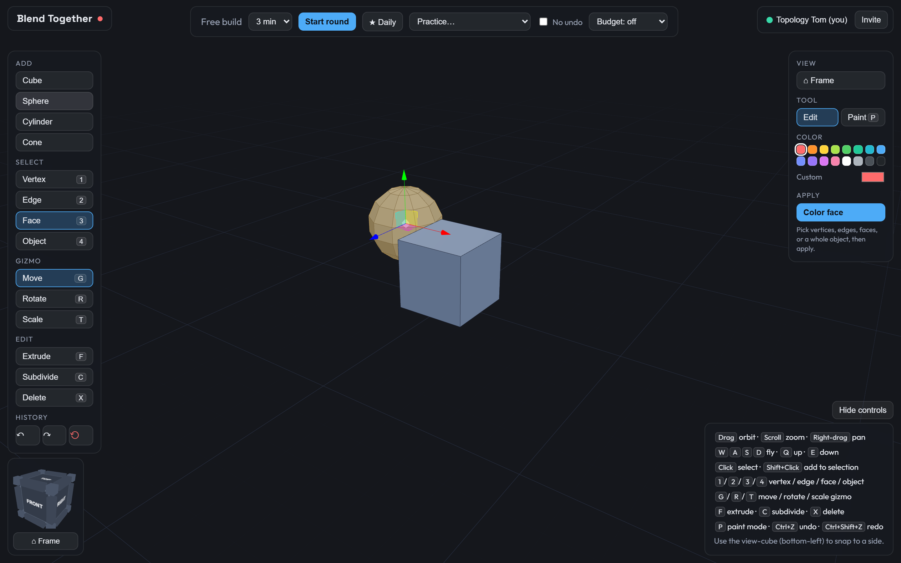

# Blend Together

A co-op 3D modeling party game for the browser. Think lightweight Blender meets Jackbox. Friends join a room from one link, get a prompt (say "a coffee mug" or "a rocket"), and sculpt **one shared low-poly model** together against a countdown. When time runs out, the app screenshots the model from six angles, sends them to Claude's vision model, and hands back a 0 to 100 match score with specific feedback.

I wanted the feeling of building something dumb with friends under time pressure, and then having an AI judge score it and tell you exactly how badly the handle on your mug turned out. That's the whole game, really.

🌐 **Play it live:** [blending3d.vercel.app](https://blending3d.vercel.app/)





## What a round looks like

1. First-time visitors get an interactive tutorial that walks through orbit, select, move, extrude, subdivide, and undo (it only advances when you actually do the thing).
2. Warm up in free-build, or take a solo **Practice** lesson (table, mug, sailboat, windmill), each scored by the same AI pipeline.
3. Hit **Start round**. Everyone gets the same prompt and timer, the model resets to a cube, and the group builds together. Optional **modifiers** mix things up: *No undo*, and a *primitive budget* (a cap on how many shapes you can add), both enforced for every player in the room.
4. Or take the **★ Daily** challenge: one global prompt per day, your team's score goes on the server-wide leaderboard, and each player builds a per-day streak.
5. On timeout the AI judge scores the model. The reveal screen shows the score, the feedback, a sped-up **timelapse replay** of the build, and (for dailies) your rank and streaks.
6. Every finished round lands in the session **Gallery**, a side-by-side grid of prompts, thumbnails, scores, and verdicts.

## Quick start (local dev)

You'll need **Node 24+**. The server uses the built-in `node:sqlite`, which is unflagged on Node 24, and a `.node-version` is checked in.

```bash
npm install

# server config: the API key lives ONLY on the server
cp server/.env.example server/.env
#   then edit server/.env and set ANTHROPIC_API_KEY=sk-ant-...

npm run dev
```

- Client: http://localhost:5173 (a random `?room=` is created for you; share the URL to invite people)
- Server: http://localhost:4000 (HTTP scoring API plus Yjs websocket sync, same port)

Want to test multiplayer solo? Open the same room URL in a second browser window, or run `node scripts/fake-player.mjs <room-id>` to spawn a headless bot that joins, shows a live cursor and selection, and edits the model for about 25 seconds.

## The modeling tools

- **Select modes** `1` / `2` / `3` / `4`: vertex, edge, face, or whole **object**. Object mode clicks a face and grabs the entire connected island (a cube you added, an extruded arm), computed on the fly from shared vertices (no group ids stored in the CRDT).
- **Gizmo** `G` / `R` / `T`: move, rotate, scale. Rotate and scale work around the selection's centroid, so you can twist an extruded arm or taper a rocket nose the Blender way. Drag the arrows, rings, or handles.
- **Edit**: `F` extrude, `C` subdivide, `X` delete.
- **Color** (Edit tool): pick vertices/edges/faces/an object, choose a color, and hit **Color face** (the button renames itself to the current mode). Face and object selections get a flat fill; vertex and edge selections set per-vertex colors that override the fill.
- **Paint** (`P`): free-draw right on the surface. Left-drag paints, right-drag orbits. Each face is its own little canvas (a UV atlas texture), so you can draw anywhere on a face, not just at its corners. Three pens (Marker, Airbrush, Highlighter) with size and flow sliders. Strokes live in the shared doc, so paint syncs to everyone and is undoable.

Camera: **orbit** left-drag, **zoom** scroll, **pan** right-drag, or **fly** with `W A S D` (plus `Q`/`E` for up/down). The **view-cube** in the bottom-left snaps you to an angle like the nav gizmo in Blender or Fusion, and **⌂ Frame** recenters on the model. `Ctrl+Z` / `Ctrl+Shift+Z` undo and redo, color and paint included.

## How the multiplayer works

The shared model is a [Yjs](https://docs.yjs.dev/) document synced through `y-websocket` (the room name is the websocket path). The mesh lives in shared collections on the doc: `verts` (vertex id to `[x,y,z]`), `faces` (face id to an ordered list of vertex ids), `faceColors` / `vertColors`, and `strokes` (the free-draw paint dabs).

The nice thing is, concurrent edits merge **per key**. Two people moving different vertices never conflict, and two people moving the *same* vertex resolve last-writer-wins on that vertex alone. Everything else rides the same doc too:

- **Undo/redo** is a `Y.UndoManager` scoped to your own transaction origin, so you undo *your* edits, never a teammate's.
- **Game state** (`phase`, `prompt`, `endsAt`, `result`) lives in a `game` Y.Map, so the timer and reveal stay in sync and a reconnecting player lands in the current phase with the current model.
- **Presence** uses Yjs awareness: name, color, a live 3D cursor (throttled to 20 Hz), and the current selection, which peers render tinted in that player's color.

There's no privileged host. Anyone can start a round, and when the countdown expires the connected client with the lowest awareness id is elected to run scoring. A watchdog re-elects if that client vanishes mid-judging, so a dropped "host" never strands the round.

The timelapse is the one deliberately local piece. Each client records the round as a log of Yjs updates (from the moment *they* joined) and replays it into a throwaway doc on the reveal screen. No extra network traffic, and late joiners replay exactly what they saw.

## How the scoring works

1. The elected client rebuilds the model into a fresh offscreen Three.js scene (no grid, gizmos, or cursors) and renders 512x512 PNGs from six angles: front, right, back, left, top, and a three-quarter view.
2. It POSTs `{ prompt, images }` to `POST /score`. On failure the client retries once, then shows a friendly error state with a retry button.
3. The server calls the Anthropic Messages API (`claude-opus-4-8` by default, override with `SCORING_MODEL`) with all six images and a judging rubric. The response is locked to a JSON schema via structured outputs, so the reply is guaranteed to parse:

```json
{
  "score": 0-100,
  "recognizable": true,
  "strengths": ["clear cylindrical body", "handle is present and attached"],
  "issues": ["handle is too thick relative to the cup"],
  "one_line_verdict": "That's a mug alright, a mug that skips arm day never."
}
```

The API key is read from `ANTHROPIC_API_KEY` on the server only. It never reaches the client bundle.

The daily challenge works the same way, except the prompt is derived once per UTC day (a seeded hash into a curated list) and results are stored server-side in SQLite (via Node's built-in `node:sqlite`, no native deps). Scoring the daily happens server-side too, so scores can't be forged.

## Architecture

```
client/  React + TypeScript + Vite, Three.js via @react-three/fiber + drei
  src/mesh/       mesh data model (Yjs), geometry + color, object connectivity, paint atlas
  src/net/        room session: websocket provider, awareness, presence
  src/game/       round state machine, screenshot capture, timelapse recorder, API client
  src/state/      zustand UI store + editor actions
  src/components/ canvas scene, toolbar, color/paint panel, HUD, tutorial, timelapse, modals

server/  Node + TypeScript (one process, one port)
  src/index.ts    express HTTP API + y-websocket room sync (ws upgrade)
  src/score.ts    Anthropic Messages API call (vision + structured output)
  src/daily.ts    daily challenge: SQLite, leaderboard, streaks
```

## Tests

`npm test` runs both suites:

- **client** (vitest): the mesh core. Primitives, extrude/subdivide/delete invariants, orphan pruning, per-client undo across two synced docs, gizmo transform math, object connectivity, and color/brush blending.
- **server** (node:test): daily-challenge logic. Prompt determinism, leaderboard ranking, and streak rules (same-day, consecutive-day, gaps, month boundaries).

## Deployment

WebSockets need a stateful host, so this deploys as **one always-on Node service** that serves everything: the built client, the scoring API, and the Yjs room sync, all on a single port and origin. That's what makes online multiplayer just work. Friends open the same `https://your-app/?room=<code>` link (or use the **Invite** button) and their browsers sync against the server that served the page. No separate client and API URLs to keep in step.

**Render (recommended, config included).** Push to GitHub, then in Render pick **New + → Blueprint** and point it at the repo. [`render.yaml`](render.yaml) provisions the service. Set `ANTHROPIC_API_KEY` as a dashboard secret. Build is `npm install && npm run build`, start is `npm start`. Render injects `$PORT` and terminates TLS, so sync upgrades to `wss://` automatically. Any host that runs a long-lived Node 24 process (Railway, Fly, a VPS) works the same way.

One gotcha: build order matters. The root `npm run build` builds the server *then* the client, so `client/dist/` exists for the server to serve at boot.

Room documents live in server memory (rooms are temporary party lobbies), so restarting clears in-progress models. On Render's free tier the process also sleeps after inactivity and cold-starts on the next visit.

## Status

Everything below is built and playable:

- ✅ **Phase 0**: single-player mesh editor (primitives, vertex/edge/face selection, move gizmo, extrude, subdivide, delete, undo/redo)
- ✅ **Phase 1**: game loop (prompt, countdown, 6-angle capture, AI scoring, reveal, retry handling)
- ✅ **Phase 2**: multiplayer (room links, live mesh sync, colored cursors and selections, synchronized rounds, reconnect handling)
- ✅ **Phase 3**: onboarding (action-gated interactive tutorial, scored practice lessons)
- ✅ **Phase 4**: daily challenge with global leaderboard and per-player streaks, run modifiers, timelapse replay, session gallery
